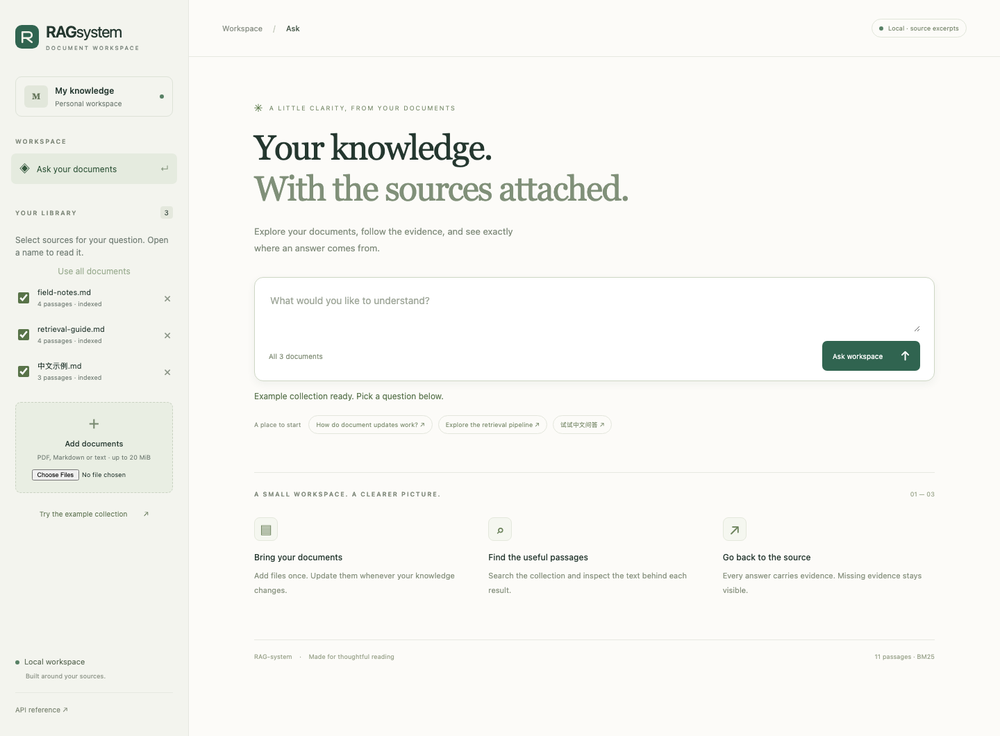
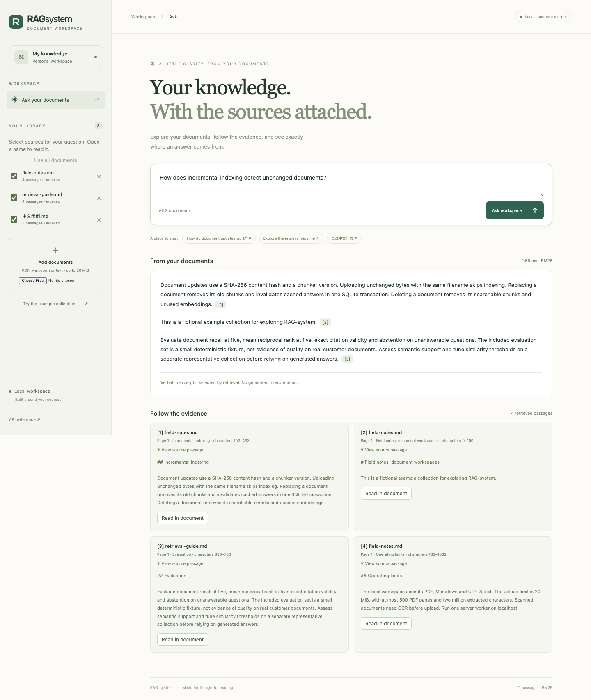
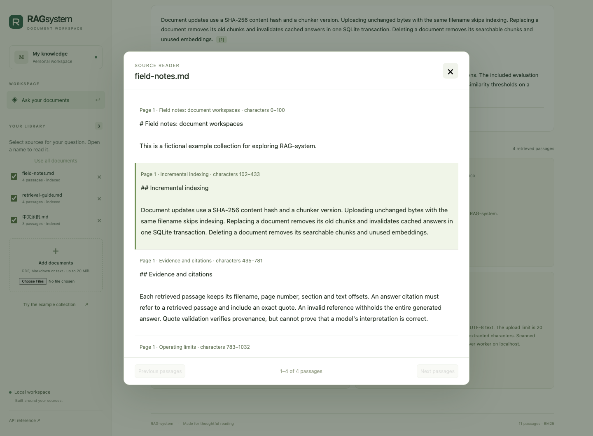

<div align="center">

# RAG-system

**A small document workspace. Answers you can trace.**

[](https://github.com/MengyangGao/RAG-system/actions/workflows/ci.yml)


Bring PDFs, notes and Markdown together. Search them, inspect the evidence,
and connect a local or remote model when you want generated answers.

[Quick start](#quick-start) · [Architecture](docs/architecture.md) · [Evaluation](#evaluation) · [Development](CONTRIBUTING.md)



</div>

## Why this project

A document Q&A system should make its sources and failure modes easy to inspect.
RAG-system keeps the complete path—from document replacement to answer citations—in
one Python package and one SQLite database. The interface ships with the package;
there is no frontend build step or mandatory cloud service.

- **Incremental ingestion:** SHA-256 change detection, transactional replacement and deletion,
  reusable embeddings, and answer-cache invalidation.
- **Inspectable retrieval:** SQLite FTS5/BM25, explicit CJK tokenization, optional dense retrieval
  with reciprocal rank fusion, optional cross-encoder reranking, and duplicate suppression.
- **Evidence-linked answers:** page/section/character provenance, exact quote validation,
  and withheld answers when generated evidence fails validation.
- **Provider choice:** offline source excerpts, Ollama, or a Chat Completions-compatible endpoint.
- **Practical UI:** select which documents a question may use, open citations in a paginated
  source reader, upload a collection, try example questions, and remove files.
  Responsive layout, keyboard submission, visible progress, and useful error states.
- **Reproducible engineering:** a committed `uv.lock`, offline regression tests, browser smoke
  tests, fixture evaluation and CI across Python 3.11–3.13 on macOS, Windows and Linux.

## Quick start

Install [uv](https://docs.astral.sh/uv/getting-started/installation/), then:

```bash
git clone https://github.com/MengyangGao/RAG-system.git
cd RAG-system
uv sync --locked
uv run rag-system serve
```

Open **http://127.0.0.1:8000** and choose **Try the example collection**, or upload your own
PDF, Markdown or UTF-8 text. The default mode returns relevant **verbatim excerpts**;
it does not require an API key, model download, or paid service.

The collection is stored in `.data/knowledge.sqlite3`. Uploading an unchanged file is a
no-op; uploading changed content under the same filename replaces its index. Use the
remove button to delete a document from the searchable collection. Select documents with
the library checkboxes; an empty selection disables asking. Click a filename to read its
indexed text, or **Read in document** beside an answer to highlight the cited passage.
The reader shows extracted text, not the original PDF layout.

```bash
uv run rag-system demo
uv run rag-system ingest notes.md handbook.pdf
uv run rag-system ask 'How does incremental indexing work?'
```

You can also install the package with `python -m pip install .` and use `rag-system`
directly. Run one server worker. The CLI serves on loopback only.

## Generated answers, when you want them

Configuration uses environment variables; [.env.example](.env.example) is a reference,
not an automatically loaded secrets file. Set variables using your shell's syntax.
The following examples use a POSIX shell.

**Ollama:** use a model you have already installed locally.

```bash
export RAG_PROVIDER=ollama
export RAG_BASE_URL=http://127.0.0.1:11434
export RAG_MODEL=your-installed-model
uv run rag-system serve
```

**Compatible APIs:** configure a provider supporting Chat Completions JSON mode.
Use an HTTPS base URL ending in `/v1` where required by your provider.

```bash
export RAG_PROVIDER=compatible
export RAG_BASE_URL=https://your-provider.example/v1
export RAG_MODEL=your-model-id
export RAG_API_KEY=your-key
uv run rag-system serve
```

Remote generation sends the question and retrieved passages to the configured provider.
Credentials stay on the server. Source identifiers and quotations are validated before
an answer is displayed. **An exact quotation is evidence of provenance, not proof that
a generated statement follows from it.** Review the linked passages.

## Optional semantic retrieval and reranking

```bash
uv sync --locked --extra semantic
export RAG_EMBEDDING_MODEL=sentence-transformers/all-MiniLM-L6-v2
export RAG_RERANK_MODEL=cross-encoder/ms-marco-MiniLM-L6-v2
uv run --extra semantic rag-system serve
```

These are small English model examples, not a claim of best-in-class retrieval.
Choose models appropriate to your language and documents. The first run downloads
model weights unless the configured identifiers point to local directories. No remote
model code is trusted. Keep model identifiers versioned if you replace their weights.
Embeddings are keyed by model identity (including resolved Hub revision when available)
and chunk hash. Existing documents are embedded
lazily when semantic search is enabled. You may enable either optional component alone.

## Architecture

```text
PDF / Markdown / text → bounded extraction → page + section chunks
                                          ↓
                          SQLite documents + FTS5 + embedding cache
                                          ↓
             BM25 + optional dense candidates → RRF → optional reranker
                                          ↓
                   source excerpts / structured provider response
                                          ↓
                       exact evidence checks → answer or abstention
```

See [architecture and tradeoffs](docs/architecture.md) for index lifecycle, cache keys,
concurrency, model boundaries, and source references. The local API reference is at
**http://127.0.0.1:8000/docs**. Key endpoints are `POST /api/documents`,
`DELETE /api/documents/{id}`, `GET /api/documents/{id}/passages`, `POST /api/ask`, and `GET /api/status`.
`POST /api/ask` accepts optional `document_ids`: omitted/null searches the whole library;
`[]` searches nothing. Unknown IDs fail explicitly. Both BM25 and dense candidates are
filtered before ranking, and cached answers are isolated by the selection.

<details>
<summary>See a real answer and its source passages</summary>





</details>

## Evaluation

```bash
uv run rag-system evaluate eval/questions.jsonl --output artifacts/evaluation.json
```

The evaluator creates an isolated temporary index and reports document recall@5,
document MRR@5, exact citation validity and unanswerable-question abstention. The
[committed result](docs/evaluation.json) includes corpus and dataset hashes plus per-case
retrieval results. The ten bundled questions are a deterministic regression fixture,
**not a general RAG benchmark**. They do not measure model faithfulness, OCR quality,
production latency, or multilingual retrieval quality.

Bring a representative collection and a separate labeled evaluation set before making
quality claims. Each JSONL row has `question` and `relevant_documents` (filenames).
An empty relevant-document list marks an unanswerable question. Optional `search_documents`
limits retrieval by filename. Optional `required_passages` contains `{"document": "file.md",
"quote": "exact indexed text"}` anchors: the evaluator rejects invalid labels and reports
passage-anchor recall separately from document recall.

A second [frozen reference set](eval/reference/README.md) contains **18 manually labeled
questions over three real engineering documents**. Its [committed BM25 result](docs/reference-evaluation.json)
finds 14/15 expected passage anchors (93.3%), document MRR 0.90, and abstains on all three
empty-scope/out-of-corpus cases. The Chinese question against English text fails and stays
in the regression set. These small-set results are not evidence of general multilingual
retrieval quality.

```bash
uv run rag-system evaluate eval/reference/questions.jsonl --corpus eval/reference/corpus
```

## Development

```bash
uv run ruff check .
uv run ruff format --check .
uv run mypy src/rag_system
uv run pytest --cov=rag_system --cov-fail-under=85
uv build

# Real browser smoke test and screenshots, using an isolated temporary collection
uv sync --locked --group browser
uv run --group browser playwright install chromium
uv run --group browser python tools/smoke_ui.py
```

The browser test exercises loading, ingestion, question submission, citations, cached
answers, document selection, highlighted source reading, refusal, safe text rendering,
deletion and a 390 px mobile layout. It never
uses your private collection or configured provider. See [contributing](CONTRIBUTING.md)
and the [modernization audit](docs/modernization.md) for validation scope.

## Limits and project history

This is a local, single-user workspace. Uploads are limited to 20 MiB, 500 PDF pages and
two million extracted characters. Scans need OCR first. Complex PDF tables and columns
may extract poorly. Dense search scans cached vectors in memory; long indexing and
model requests serialize other work. There is no authentication, automatic folder watch,
background job service, token streaming or multi-tenant hosting layer.

SQLite stores unencrypted local data. Record deletion is not secure erasure. Read the
[security and data boundaries](SECURITY.md) before using sensitive documents.

The 2024 Streamlit prototype is preserved in Git history at `08ac3f4`. Its UI code,
position-based FAISS cache, and provider-specific SDK wrappers have been replaced.
Re-import original documents into the new index; old `.npy` and JSON caches are not migrated.

Original work by Mengyang Gao (Kevin Stark), Jiarui Feng and Bowen Wang, with Qwen
support contributed by [EPTansuo](https://github.com/EPTansuo). The original repository
did not declare a software license; a license has not been assigned to others' work
as part of this modernization.
